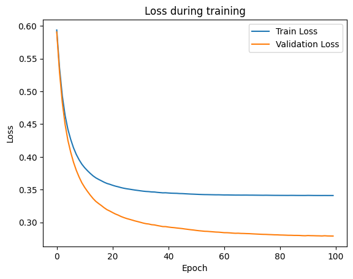
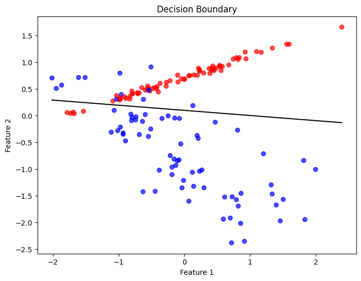
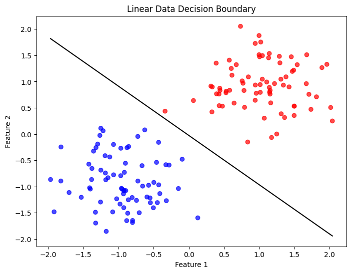
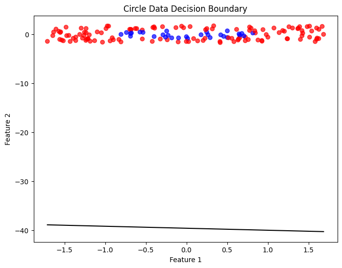
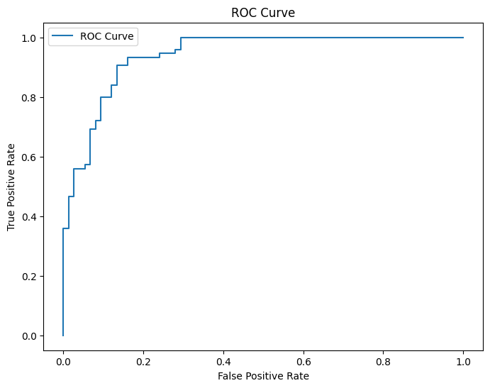

# Однослойный перцептрон: реализация, обучение и анализ

## Описание проекта

В данной лабораторной работе реализован однослойный перцептрон для задачи бинарной классификации без использования готовых моделей машинного обучения (`PyTorch`, `TensorFlow`, `sklearn.linear_model`).

В ходе работы были реализованы:

* подготовка и нормализация данных;
* обучение однослойного перцептрона;
* mini-batch gradient descent;
* визуализация функции потерь и разделяющей границы;
* исследование влияния гиперпараметров;
* генерация собственных синтетических данных;
* реализация `Hinge Loss`;
* реализация `L2-регуляризации`;
* вычисление метрик качества;
* ROC-кривая;
* momentum gradient descent;
* k-fold cross-validation.

---

# Структура проекта

```text
.
├── perceptron.py
├── preparation.py
├── custom_data.py
├── experiments.py
├── main.py
├── notebook.ipynb
└── README.md
```

---

# Используемые библиотеки

```python
numpy
matplotlib
scikit-learn
```

---

# Подготовка данных

Для генерации данных использовалась функция `make_classification`:

```python
make_classification(
    n_samples=500,
    n_features=2,
    n_redundant=0,
    n_informative=2,
    random_state=42,
    n_clusters_per_class=1
)
```

Данные были разделены на:

* train — 70%
* validation — 15%
* test — 15%

Для признаков применялась стандартизация:

```text
X' = (X - μ) / σ
```

---

# Реализация перцептрона

Реализованы:

* инициализация весов;
* sigmoid activation;
* forward pass;
* binary cross-entropy loss;
* mini-batch gradient descent;
* prediction function.

Сигмоида:

```text
σ(z) = 1 / (1 + e^(-z))
```

Binary Cross-Entropy:

```text
L = -(y log(ŷ) + (1-y) log(1-ŷ))
```

---

# Обучение модели

Гиперпараметры:

| Параметр      | Значение |
| ------------- | -------- |
| Learning rate | 0.1      |
| Epochs        | 100      |
| Batch size    | 32       |

Результаты:

| Метрика        | Значение |
| -------------- | -------- |
| Train Accuracy | 0.872    |
| Test Accuracy  | 0.887    |

---

# Графики обучения

## Изменение функции потерь

```md

```

## Разделяющая граница

```md

```

---

# Эксперименты и анализ

## Влияние learning rate

Проверялись значения:

```python
[0.001, 0.01, 0.1, 0.5, 1.0]
```

Результаты:

| Learning Rate | Train Accuracy | Test Accuracy |
| ------------- | -------------- | ------------- |
| 0.001         | 0.862          | 0.880         |
| 0.01          | 0.865          | 0.887         |
| 0.1           | 0.872          | 0.887         |
| 0.5           | 0.865          | 0.887         |
| 1.0           | 0.862          | 0.887         |

### Вывод

Маленький learning rate приводит к медленной сходимости модели. При слишком больших значениях обучение становится менее стабильным. Наиболее хорошие результаты показали значения `0.1` и `0.5`.

---

## Влияние размера batch

Проверялись значения:

```python
[1, 16, 32, 64, 256]
```

Результаты:

| Batch Size | Train Accuracy | Test Accuracy |
| ---------- | -------------- | ------------- |
| 1          | 0.869          | 0.887         |
| 16         | 0.872          | 0.887         |
| 32         | 0.872          | 0.887         |
| 64         | 0.869          | 0.887         |
| 256        | 0.865          | 0.887         |

### Вывод

Маленький batch size делает обучение более шумным. Большие batch size обеспечивают более плавное обучение. Наиболее стабильные результаты показали значения `16` и `32`.

---

## Влияние инициализации весов

Сравнивались:

* нулевая инициализация;
* маленькие случайные веса;
* большие случайные веса.

Результаты:

| Initialization | Train Accuracy | Test Accuracy |
| -------------- | -------------- | ------------- |
| zeros          | 0.865          | 0.887         |
| small_random   | 0.862          | 0.887         |
| large_random   | 0.865          | 0.887         |

### Вывод

На данной задаче тип инициализации не оказал сильного влияния на итоговую точность. Однако большие веса могут приводить к насыщению sigmoid на более сложных задачах.

---

# Собственный генератор данных

Реализованы:

* линейно разделимые данные;
* нелинейные данные типа «окружность»;
* добавление шума.

---

## Линейно разделимые данные

Результаты:

| Метрика        | Значение |
| -------------- | -------- |
| Train Accuracy | 1.0      |
| Test Accuracy  | 1.0      |

### Разделяющая граница

```md

```

### Вывод

Перцептрон успешно разделяет линейно разделимые данные и строит корректную разделяющую границу.

---

## Нелинейные данные (окружность)

Результаты:

| Метрика        | Значение |
| -------------- | -------- |
| Train Accuracy | 0.801    |
| Test Accuracy  | 0.807    |

### Разделяющая граница

```md

```

### Вывод

Однослойный перцептрон не способен корректно разделять нелинейные структуры данных, так как строит только линейную границу.

---

# Hinge Loss

Реализован отдельный класс `HingePerceptron`.

Функция потерь:

```text
L = max(0, 1 - yz)
```

Результаты:

| Loss Function | Accuracy |
| ------------- | -------- |
| BCE           | 0.887    |
| Hinge         | 0.920    |

### Вывод

Hinge Loss показал более высокую точность и более быструю сходимость по сравнению с Binary Cross-Entropy.

---

# L2-регуляризация

Добавлена L2-регуляризация:

```text
L_reg = L + λ ||w||²
```

Результаты:

| λ | Train Accuracy | Test Accuracy | ||w|| |
|---|---|---|---|
| 0.0 | 0.872 | 0.887 | 3.022 |
| 0.001 | 0.865 | 0.887 | 2.878 |
| 0.01 | 0.869 | 0.887 | 2.088 |
| 0.1 | 0.862 | 0.887 | 0.856 |
| 1.0 | 0.865 | 0.887 | 0.161 |

### Вывод

При увеличении коэффициента регуляризации веса модели становятся меньше. Небольшие значения λ почти не ухудшают качество модели, а большие значения приводят к недообучению.

---

# Метрики качества

Были вычислены следующие метрики:

| Метрика   | Значение |
| --------- | -------- |
| Precision | 0.854    |
| Recall    | 0.933    |
| F1-score  | 0.892    |
| ROC-AUC   | 0.941    |

### ROC-кривая

```md

```

---

# Momentum Gradient Descent

Реализован `MomentumPerceptron`.

Формулы:

```text
v = βv + ∇L
w = w - ηv
```

Результаты:

| β    | Accuracy |
| ---- | -------- |
| 0    | 0.887    |
| 0.5  | 0.887    |
| 0.9  | 0.887    |
| 0.99 | 0.880    |

### Вывод

Momentum ускоряет сходимость градиентного спуска и делает обучение более стабильным. Слишком большой momentum (`β = 0.99`) приводит к колебаниям функции потерь.

---

# K-Fold Cross Validation

Использовалась:

* 5-fold cross-validation.

Подбирались:

* learning rate;
* batch size.

Результаты:

| Learning Rate | Batch Size | Mean Accuracy | Std   |
| ------------- | ---------- | ------------- | ----- |
| 0.001         | 16         | 0.862         | 0.038 |
| 0.001         | 32         | 0.864         | 0.039 |
| 0.001         | 64         | 0.864         | 0.040 |
| 0.01          | 16         | 0.878         | 0.026 |
| 0.01          | 32         | 0.874         | 0.030 |
| 0.01          | 64         | 0.864         | 0.035 |
| 0.1           | 16         | 0.880         | 0.029 |
| 0.1           | 32         | 0.880         | 0.029 |
| 0.1           | 64         | 0.878         | 0.026 |

Лучшие параметры:

| Parameter     | Value |
| ------------- | ----- |
| Learning Rate | 0.1   |
| Batch Size    | 16    |

Best CV Accuracy:

```text
0.880
```

### Вывод

5-fold cross-validation позволила более надёжно подобрать гиперпараметры модели и оценить устойчивость результатов.

---

# Как добавить графики в README

## 1. Создайте папку

```text
images
```

в корне проекта.

## 2. Сохраните график

```python
plt.savefig("images/loss.png")
```

## 3. Добавьте изображение в README

```md

```

---

# Запуск проекта

Установка зависимостей:

```bash
pip install numpy matplotlib scikit-learn
```

Запуск:

```bash
python main.py
```

---

# Итог

В ходе работы был реализован однослойный перцептрон и исследованы различные аспекты его обучения: функции потерь, регуляризация, momentum, подбор гиперпараметров и качество классификации.

Эксперименты показали, что однослойный перцептрон хорошо работает только на линейно разделимых данных и имеет ограничения на нелинейных задачах.
